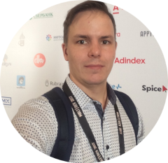

---
# Feel free to add content and custom Front Matter to this file.
# To modify the layout, see https://jekyllrb.com/docs/themes/#overriding-theme-defaults

layout: page
---
  
Email: [roman.ekimov@gmail.com](mailto:roman.ekimov@gmail.com)  
Telegram: [@toywar](https://t.me/toywar)  
Location: Belgrade, Serbia  
LinkedIn: [roman-ekimov](https://www.linkedin.com/in/roman-ekimov-03b23298/)

## Specialties
---
- **Operating Systems & Linux:** Linux OS family (Ubuntu, Debian, RHEL, CentOS)
- **Infrastructure as Code & Configuration:** Terraform, OpenTofu, Ansible, Chef, Packer
- **Containerization & Orchestration:** Docker, Docker Compose, Kubernetes, Docker Swarm, Nomad, Helm, ArgoCD
- **Cloud Platforms:** Google Cloud Platform (GCP), AWS, DigitalOcean, Servercore, Yandex Cloud
- **CI/CD & GitOps:** GitLab CI/CD, ArgoCD, Jenkins
- **Security & Secret Management:** HashiCorp Vault, OpenBao, PCI DSS compliance
- **Message Brokers:** Apache Kafka, Cloud Pub/Sub, RabbitMQ
- **Web Servers & Load Balancing:** Nginx, HAProxy
- **Databases & Caching:** PostgreSQL, ClickHouse, MongoDB, Redis
- **Monitoring & Observability:** Prometheus, VictoriaMetrics, Grafana, ELK Stack, Zabbix
- **SRE & Production Operations:** High availability, SLA/SLO tracking, incident response, postmortems
- **Programming & Scripting:** Go (Golang), Bash (automation, custom CLI, and monitoring tools)

## Experience
---
`January 2026 – Present`
### [Finharbor](https://finharbor.io) - Fintech company
> DevOps Lead

- Leading and mentoring the DevOps and infrastructure engineering team (sprint planning, task prioritization, and technical roadmaps)
- Driving infrastructure strategy and architecture for fintech microservices, ensuring high availability, disaster recovery, and compliance readiness
- Reduced company infrastructure costs by up to 30% through workload rightsizing, architecture optimization, committed-use discounts, and resource cleanup across cloud providers
- Communicating and collaborating directly with enterprise clients and stakeholders regarding infrastructure architecture, integrations, security requirements, and SLA guarantees
- Standardizing GitOps, CI/CD, and IaC practices across engineering teams to accelerate product release cycles and ensure deployment consistency
- Establishing incident response protocols, on-call schedules, and postmortem workflows to maintain high reliability and compliance standards

`August 2024 – December 2025`
### [Finharbor](https://finharbor.io) - Fintech company
> DevOps Engineer

- Designed, maintained, and scaled multi-cloud and hybrid infrastructure across **Google Cloud Platform (GCP)**, **Servercore**, and **DigitalOcean**, as well as bare-metal and VM environments
- Implemented and managed Infrastructure as Code (**IaC**) using **Terraform, OpenTofu, Helm, ArgoCD, Ansible, and Packer** for fintech microservices
- Built automated CI/CD pipelines in **GitLab CI** and GitOps workflows via **ArgoCD**, creating **Helm** charts to deploy polyglot microservices (**Java, Kotlin, JavaScript/TypeScript, Rust, Go**) into cloud **Kubernetes (GKE)** clusters
- Participated in the **PCI DSS** audit and certification process: enforced infrastructure security controls, network isolation, audit logging, and secret management using **HashiCorp Vault / OpenBao**
- Designed and maintained comprehensive observability and monitoring stacks (**Prometheus, VictoriaMetrics, Grafana**), implementing SRE practices to ensure 99.99% uptime for core financial services
- Managed and tuned data stores and streaming platforms including **PostgreSQL, Redis, and Apache Kafka** for low-latency transaction processing

`November 2022 – August 2024`
### Blockchain Family - Blockchain integrations
> DevOps Engineer (Fintech team)

- Supported and improved **GCP** cloud infrastructure and Docker Compose environments across bare-metal and VM platforms
- Developed and maintained **IaC** for fintech and blockchain projects in GCP using **Terraform, Ansible, and Packer**
- Built CI/CD pipelines in **GitLab CI** and **Helm** charts to deploy **Java, Rust, and Go** applications into cloud **Kubernetes (GKE)** clusters
- Implemented DevOps workflows, containerization, and deployment automation for a decentralized messaging platform based on the **Matrix** protocol
- Established infrastructure observability and SRE practices to ensure service stability, fault tolerance, and high availability

`June 2021 – October 2022`
### [Tinkoff Bank](https://www.tbank.ru) - TOP-10 Bank & Fintech Ecosystem
> DevOps Engineer, SRE (Processing Systems Infrastructure team)

- Maintained and optimized enterprise **Linux**-based infrastructure (**RHEL, CentOS, Ubuntu**) for mission-critical core banking services
- Developed custom automation, diagnostic, and monitoring utilities in **Go (Golang)** for specialized infrastructure metrics and operations
- Implemented **IaC** for enterprise observability and logging stacks, including **Prometheus, ELK Stack, and Zabbix**
- Built CI/CD pipelines (**GitLab CI, Jenkins, Docker Compose**) and deployment manifests (**Kustomize, Helm**) for **Java, Rust, and Go** applications across on-premise and cloud **Kubernetes / Docker Swarm** clusters (bare-metal, VMs, AWS)
- Served as an **SRE** ensuring 24/7 reliability and uptime of high-load transaction processing systems (on-call rotations, SLA/SLO tracking, incident troubleshooting, and postmortems)

`December 2018 – May 2021`
### [EXANTE](https://www.exante.eu) - Investment company
> Infrastructure Engineer (OPS team)

- Designed and deployed a highly available centralized logging infrastructure (**Elasticsearch + Graylog + Fluentd**) with **HAProxy** load balancing across all company services and servers
- Built and managed an on-premise **Kubernetes** cluster on bare-metal hardware for core trading and internal services
- Migrated CI/CD pipelines from Jenkins to **GitLab CI**, improving build reliability and deployment speed
- Maintained **Linux** server infrastructure (Ubuntu, Debian) using Configuration as Code with **Chef**
- Automated HR onboarding and offboarding workflows with custom integrations between **BambooHR** and **Google Workspace**
- Administered and customized Atlassian products (**Jira, Confluence**) and plugins for engineering workflows and documentation
- Supported low-latency market connectivity tools and trading infrastructure (**FIX protocol**, trading terminals) connected to major global exchanges (NYSE, NASDAQ, LSE, etc.)
- Temporarily led the Operations (OPS) team, coordinating infrastructure maintenance, sprints, and support requests

`September 2011 – November 2018`
### Center for Pedagogical Excellence (Center of Pedagogical Skills)
> IT Support, Network Engineer (IT team)

- Administered **Linux and Windows** servers along with all center workstations (**Windows, macOS**)
- Managed campus local area network infrastructure (**NOC**): configured and maintained **Cisco, MikroTik, Extreme Networks, and HP** network equipment; established site-to-site connectivity across three buildings in Moscow
- Built an automated provisioning system for rapid OS deployment and software configuration across hundreds of laptops for academic olympiads and training sessions
- Implemented infrastructure-wide monitoring and dashboards using **Observium, InfluxDB, Telegraf, and Grafana**

## Education
---

`2007 – 2012`

**Moscow University for Industry and Finance**

Specialist / Master's Degree in Applied Informatics in Economics (Faculty of Information Technologies)
